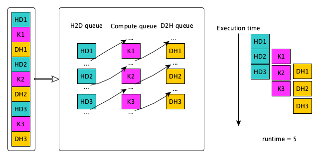

# Outline

* Streams 
* Events
* Synchronization

# Streams

- What is a stream?
    - A sequence of operations that execute in order on the GPU
    - Operations in different streams may run concurrently

{width=1100px}

- In figure, the kernel and D-to-H copy is split into 4 streams


# Streams

{width=1600px}

- In this figure, H-to-D copy, kernel, and D-to-H copy is split into 4 streams


# Asynchronous funtions and the default stream

<small>

- The functions without `Async`-postfix run on the default stream, and are synchronizing with host

```cpp
​hipError_t hipMalloc ( void** devPtr, size_t size )
​hipError_t hipMemcpy ( void* dst, const void* src, size_t count, hipMemcpyKind kind )
​hipError_t hipFree ( void* devPtr ) 
```

- When using non-default streams, functions with `Async`-postfix are needed
  - These functions take the stream as an additional argument (`0` denotes the default stream)

```cpp
hipError_t hipMallocAsync ( void** devPtr, size_t size, hipStream_t stream ) 
hipError_t hipMemcpyAsync ( void* dst, const void* src, size_t count, hipMemcpyKind kind, hipStream_t stream) 
hipError_t hipFreeAsync ( void* devPtr, hipStream_t stream ) 

```

- Kernels are always asynchronous, and require explicit synchronization
  - If no stream is specified in the kernel launch, the default stream is used
  - The fourth kernel argument is reserved for the stream 

```cpp
// Use the default stream
hipkernel<<<grid, block>>>(args);
// Use the default stream
hipkernel<<<grid, block, bytes, 0>>>(args);
// Use the stream strm[i]
hipkernel<<<grid, block, bytes, strm[i]>>>(args);
```

</small>

# Stream creation, synchronization, and destruction

* Declare a stream variable
```cpp
hipStream_t stream
```

* Create `stream`
```cpp
hipError_t hipStreamCreate ( hipStream_t* stream ) 
```

* Synchronize `stream`
```cpp
​hipError_t hipStreamSynchronize ( hipStream_t stream ) 
``` 

* Destroy `stream`
```cpp
​hipError_t hipStreamDestroy ( hipStream_t stream ) 
```

# Stream example

<small>
<div class="column">
```cpp
// Declare an array of 3 streams
hipStream_t stream[3];

// Create streams and schedule work
for (int i = 0; i < 3; ++i){
  hipStreamCreate(&stream[i]);

  // Each streams copies data from host to device
  hipMemcpyAsync(d_data[i], h_data[i], bytes, 
    hipMemcpyHostToDevice, stream[i]);

  // Each streams runs a kernel
  hipkernel<<<grid, block, 0, strm[i]>>>(d_data[i]);

  // Each streams copies data from device to host
  hipMemcpyAsync(h_data[i], d_data[i],  bytes, 
    hipMemcpyDeviceToHost, stream[i]);
}

// Synchronize and destroy streams
for (int i = 0; i < 3; ++i){
  hipStreamSynchronize(stream[i]);
  hipStreamDestroy(stream[i]);
}
```
</div>

<div class="column">
{height=400px}
</div>

</small>

# Events

<small>

* Create `event` object
```cpp
​cudaError_t cudaEventCreate ( cudaEvent_t* event ) 
```

* Captures in `event` the contents of `stream` at the time of this call
```cpp
cudaError_t cudaEventRecord ( cudaEvent_t event, cudaStream_t stream ) 
``` 

* Computes the elapsed time in milliseconds between `start` and `end` events
```cpp
cudaError_t cudaEventElapsedTime ( float* ms, cudaEvent_t start, cudaEvent_t end ) 
``` 

* Makes all future work submitted to `stream` wait for all work captured in `event`
```cpp
​cudaError_t cudaStreamWaitEvent ( cudaStream_t stream, cudaEvent_t event, unsigned int  flags = 0 ) 
```

* Wait for `event` to complete
```cpp
cudaError_t cudaEventSynchronize ( cudaEvent_t event ) 
``` 

* Destroy `event` object
```cpp
cudaError_t cudaEventDestroy ( cudaEvent_t event ) 
```

</small>

# Synchronization and memory

hipStreamSynchronize
  : host waits for all commands in the specified stream to complete

hipDeviceSynchronize
  : host waits for all commands in all streams on the specified device to
    complete

hipEventSynchronize
  : host waits for the specified event to complete

hipStreamWaitEvent
  : stream waits for the specified event to complete


# Example: data transfer and compute

- Serial

```cpp
hipEventRecord(startEvent,0);

hipMemcpy(d_a, a, bytes, hipMemcpyHostToDevice);
hipLaunchKernelGGL(kernel, n/blockSize, blockSize, 0, 0, d_a, 0);
hipMemcpy(a, d_a, bytes, hipMemcpyDeviceToHost);

hipEventRecord(stopEvent, 0);
hipEventSynchronize(stopEvent);

hipEventElapsedTime(&duration, startEvent, stopEvent);
printf("Duration of sequential transfer and execute (ms): %f\n", duration);
```

# Synchronization (I)

* Synchronize the host with a specific stream
```cpp
​hipError_t hipStreamSynchronize ( hipStream_t stream ) 
``` 

* Synchronize the host with a specific event
```cpp
​cudaError_t cudaEventSynchronize ( cudaEvent_t event )
``` 

* Synchronize a specific stream with a specific event (the event can be in another stream) 
```cpp
​cudaError_t cudaStreamWaitEvent ( cudaStream_t stream, cudaEvent_t event, unsigned int  flags = 0 ) 
``` 

* Synchronize the host with the whole device (wait until all device tasks are finished)
```cpp
cudaError_t cudaDeviceSynchronize ( void ) 
``` 

# Synchronization (II)

- Synchronize using Events
    - Create an event
    ```cpp
    hipEvent_t stopEvent
    hipEventCreate(&stopEvent)
    ```

    - Record an event in a specific stream and wait until ready
    ```cpp
    hipEventRecord(stopEvent,0)
    hipEventSynchronize(stopEvent)
    ```

    - Make a stream wait for a specific event
    ```cpp
    hipStreamWaitEvent(stream[i], stopEvent, unsigned int flags)
    ```


# Synchronization in the kernel

`__syncthreads()`
  : synchronize threads within a block inside a kernel

<br>

```cpp
__global__ void reverse(double *d_a) {
    __shared__ double s_a[256]; /* array of doubles, shared in this block */
    int tid = threadIdx.x;
    s_a[tid] = d_a[tid];     /* each thread fills one entry */
    __syncthreads();         /* all wavefronts must reach this point before
                                any wavefront is allowed to continue. */
    d_a[tid] = s_a[255-tid]; /* safe to write out array in reverse order */
}
```
