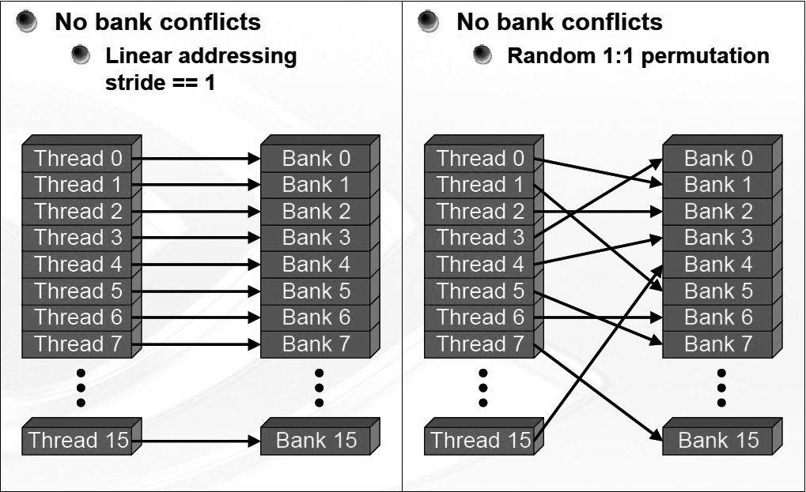
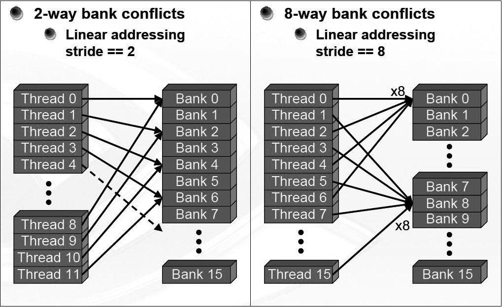
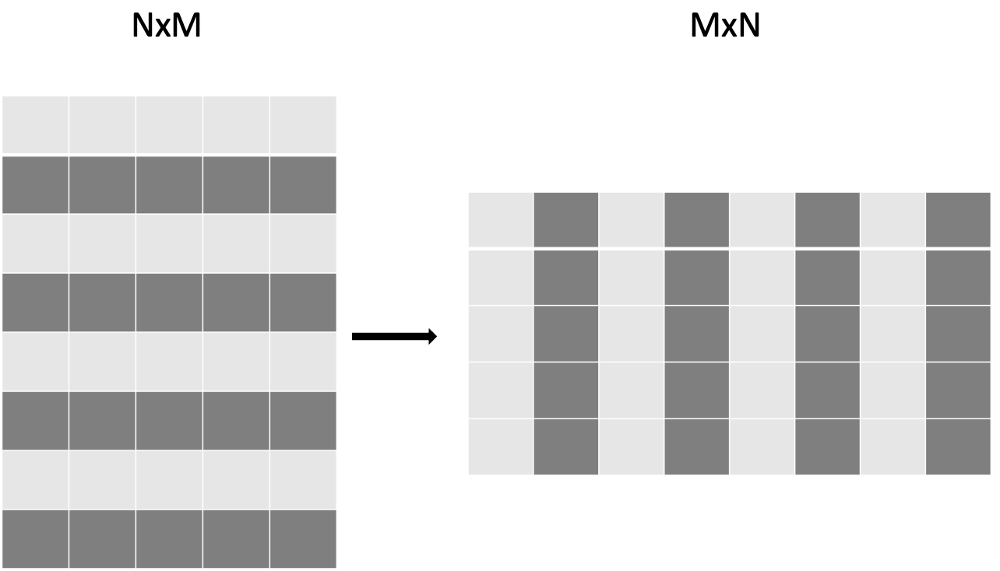

# Libraries (I)

| NVIDIA   | HIP       | ROCm       | Description                                                                         |
| -------- | --------- | ---------- | ----------------------------------------------------------------------------------- |
| cuBLAS   | hipBLAS   | rocBLAS    | Basic Linear Algebra Subroutines                                                    |
| cuFFT    | hipFFT    | rocfft     | Fast fourier Transform Library                                                      |
| cuSPARSE | hipSPARSE | rocSPARSE  | Sparse BLAS + SMV                                                                   |
| cuSOLVER | hipSOLVER | rocSOLVER  | Lapack library                                                                      |
| AMG-X    |           | rocALUTION | Sparse iterative solvers and preconditioners with Geometric and Algebraic MultiGrid |
| Thrust   | hipThrust | rocThrust  | C++ parallel algorithms library                                                     |


# Libraries (II)

| NVIDIA | HIP     | ROCm    | Description                                                                   |
| ------ | ------- | ------- | ----------------------------------------------------------------------------- |
| CUB    | hipCUB  | rocPRIM | Low level Optimized Parallel Primitives                                        |
| cuDNN  |         | MIOpen  | Deep learning solver library                                                  |
| cuRAND | hipRAND | rocRAND | Random number generator library                                               |
| EIGEN  | EIGEN   | EIGEN   | C++ template library for linear algebra: matrices, vectors, numerical solvers |
| NCCL   |         | RCCL    | Communications Primitives Library based on the MPI equivalents                |


# Kernels

You can call a kernel with the command:

```cpp
hipLaunchKernelGGL(kernel_name, dim3(Blocks), dim3(Threads), 0, 0, arg1, arg2, ...);
```

or
```cpp
kernel_name<<<dim3(Blocks), dim3(Threads),0,0>>>(arg1,arg2,...);
```
* blocks are for the 3D dimensions of the grid of blocks dimensions
* threads for the 3D dimentions of a block of threads
* 0 for bytes of dynamic LDS space, 0 for stream, kernel arguments

 **Knowledge of the hardware is required for best performance!!!**

# Compute Units (CU)

<div class="column" width=78%>
* Each AMD CU is a 64-wide execution unit, so multiple of 64 as the thread limit.
    * The 64-wide execution is sub-divided into 4 SIMD units.
    * Each SIMD unit executes a full wavefront instruction in 4 cycles.
    * Heavily dependent of the architecture.

</div>

<div class="column" width=20%>
{width=100%}
</div>
* Minimum 256 threads per block is required for the best performance, in general more tuning  (architecture dependent) is required.

# Global memory access in device code

- Global memory access from the device has high latency

- Threads are executed in wavefronts/warps, memory operations are grouped in a similar
  fashion
- Memory access is optimized for coalesced access where threads read from and write to successive memory locations
- Exact alignment rules and performance issues depend on the architecture

# Coalesced memory access

- The global memory loads and stores consist of transactions of a certain size 
- If the threads within a wavefront access data within such a block,
only one global memory transaction is needed

- Irregular access patterns result in  more transactions!

# Coalesced memory access example

<div class="column">
```
__global__ void memAccess(float *out, float *in)
{
 int tid = blockIdx.x*blockDim.x + threadIdx.x;
 if(tid != 12) out[tid + 16] = in[tid + 16];
}
```
{width=80%}
</div>

<div class="column">
```
__global__ void memAccess(float *out, float *in)
{
 int tid = blockIdx.x*blockDim.x + threadIdx.x;
 out[tid + 1] = in[tid + 1];
}
```
{width=80%}
</div>

# Shared memory I
- Fast memory on the CU
- Shared memory is divided into banks
- Each bank can service one address per cycle
- Conflicting accesses are serialized
- Conflicts solved by padding

# Shared memory II
<div class="column">
{width=100%}
</div>
<div class="column">
{width=100%}
</div>


# Shared memory III
- Can be used as user controled cache
- Useful to reduce the amount of global memory operations
- Can be used as buffer to transform uncoalesced operations in coalesced 
- Limited resources per CU

# Low level optimizations
- Avoid branching
  - All threads in  wavefront should execute the sme instruction
    - `if(tid%2==0)` would result in 2 branches
    -  better use `if(tid<N/2)`
- Sometimes recomputing can be faster than reading from the memory
- Depeding on the problem, consider using lower precision instead of `double` (math functions are available for `single` and `half` precision )

# Optimizing matrix operations. `B(i,j)=A(j,i)` 
{.center width=60%}


# Copy operation as base

```cpp
__global__ void copy_kernel(float *in, float *out, int width, int height) {
  int x_index = blockIdx.x * tile_dim + threadIdx.x;
  int y_index = blockIdx.y * tile_dim + threadIdx.y;

  int index = y_index * width + x_index;

  out[index] = in[index];
}
```

```cpp
  int block_x = width / tile_dim;
  int block_y = height / tile_dim;
   hipLaunchKernelGGL(copy_kernel, dim3(block_x, block_y),
                      dim3(tile_dim, tile_dim), 0, 0, d_in, d_out, width,
                      height);
   hipDeviceSynchronize();
```
The duration is `0.174 ms`  and the effective bandwidth `717 GB/s`

# Matrix transpose naive

```cpp
__global__ void transpose_kernel(float *in, float *out, int width, int height) {
  int x_index = blockIdx.x * tile_dim + threadIdx.x;
  int y_index = blockIdx.y * tile_dim + threadIdx.y;

  int in_index = y_index * width + x_index;
  int out_index = x_index * height + y_index;

  out[out_index] = in[in_index];
}
```


The duration is `0.401 ms`  and the effective bandwidth `311 GB/s`


# Matrix transpose with shared memory

<small>
```cpp
__global__ void transpose_lds_kernel(float *in, float *out, int width,
                                     int height) {
  __shared__ float tile[tile_dim][tile_dim];

  int x_tile_index = blockIdx.x * tile_dim;
  int y_tile_index = blockIdx.y * tile_dim;

  int in_index =
      (y_tile_index + threadIdx.y) * width + (x_tile_index + threadIdx.x);
  int out_index =
      (x_tile_index + threadIdx.y) * height + (y_tile_index + threadIdx.x);

  tile[threadIdx.y][threadIdx.x] = in[in_index];

  __syncthreads();

  out[out_index] = tile[threadIdx.x][threadIdx.y];
}
```
</small>

The duration is `0.185 ms`  and the effective bandwidth `674 GB/s`


# Matrix transpose with shared memory without bank conflicts

<small>
```cpp
__global__ void transpose_lds_kernel(float *in, float *out, int width,
                                     int height) {
  __shared__ float tile[tile_dim][tile_dim+1];

  int x_tile_index = blockIdx.x * tile_dim;
  int y_tile_index = blockIdx.y * tile_dim;

  int in_index =
      (y_tile_index + threadIdx.y) * width + (x_tile_index + threadIdx.x);
  int out_index =
      (x_tile_index + threadIdx.y) * height + (y_tile_index + threadIdx.x);

  tile[threadIdx.y][threadIdx.x] = in[in_index];

  __syncthreads();

  out[out_index] = tile[threadIdx.x][threadIdx.y];
}
```
</small>

The duration is `0.179 ms`  and the effective bandwidth `697 GB/s`


# Other examples where shared memory is critical 
- Matrix-matrix/vector multiplication
- N-body problem
- reductions

# Summary

- Uses existing provided libraries: `hipBLAS`, `hipFFT`, ...
- Coalesced memory access in kernels results in better
  performance
- Use shared memory to reduce duplicate global memory accesses or make the acceses coalesced, but watch out for bank conflicts
- Try to avoid branching of the threads inside a wavefront